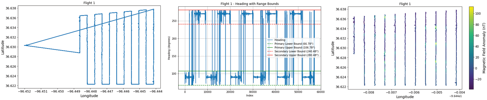
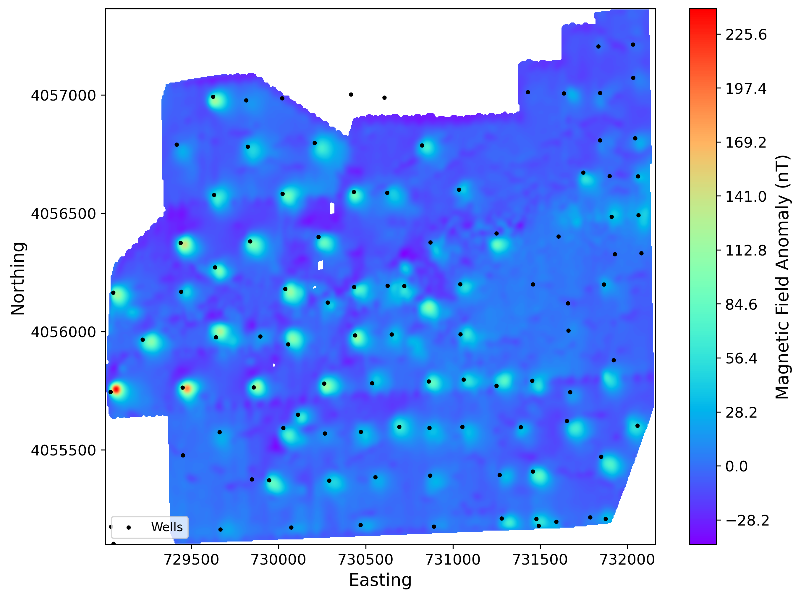

.. _WellDetective Usage:

Example Usage
========================================

The `WellDetective` class provides a modular and flexible pipeline for magnetic survey data preprocessing, correction, gridding, and anomaly detection. It supports heading-based corrections, distance-aware masking, reduction to the pole, and filtering of interpolated magnetic data using widely adopted Python scientific libraries like NumPy, SciPy, Pandas, and Xarray.

Flight Line Correction & Gridding
^^^^^^^^^^^^^^^^^^^^^^^^^^^^^^^^^^

WellDetective enables heading correction and gridding for geophysical flight line data. The goal is to prepare the dataset for anomaly analysis by:
1. Calculating headings and identifying primary/secondary directions.
2. Removing noisy turn data.
3. Performing heading-based equalization of the magnetic signal.
4. Projecting to UTM and interpolating to a regular grid.
5. Reducing the magnetic field to the pole.
6. Applying a Gaussian low-pass filter.

These steps are bundled into clean function calls, with smart masking and analysis-ready outputs.

Example
--------------------

The example below demonstrates the full use of the class to clean, grid, and filter magnetic survey data.

.. code-block:: python

    import pandas as pd
    from WellDetective import WellDetective

    # Load raw flight line data
    data = pd.read_csv("my_flight_data.asc", sep=r"\s+", skiprows=2)
    data.rename(columns={"Longitude[°]": "Long", "Latitude[°]": "Lat", "Totalfield[nT]": "Mag"}, inplace=True)

    # Initialize the processor
    processor = WellDetective(data)

    # Compute headings and remove turns
    processor.add_heading_column()
    primary, secondary = processor.find_primary_secondary_headings(tolerance=20)
    processor.remove_turning_data(primary, secondary)

    # Apply heading correction
    processor.auto_equalize_heading_correction(primary, secondary)

    # Project to UTM coordinates
    processor.project_coordinates(utm_zone=12)

    # Segment the flight lines and remove short segments
    processor.segment_and_filter_data(max_gap_distance=15, min_segment_length=100)

    # Grid and filter the data
    rtp_grid = processor.grid_and_filter_data(
        inclination=60.2,
        declination=2.1,
        grid_res=500,
        cutoff_sigma=3,
        proximity_threshold=40
    )

    # Plot the result
    rtp_grid.plot(cmap="viridis")

Flight Line with Heading Visualization
---------------------------------------

   *Heading ranges shown with colored bands over a single flight segment.*

Gridded & Filtered Magnetic Field
---------------------------------------

   *Final output magnetic field grid after RTP and low-pass filtering, ready for anomaly detection.*

