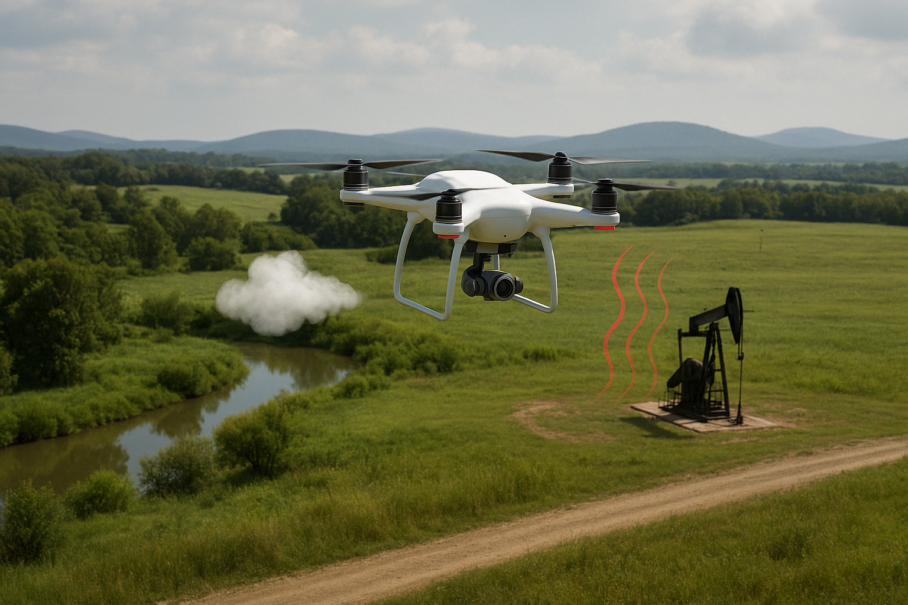

.. _WellDetective-intro:

.. WellDetective documentation master file, created by Eric Guiltinan 3 April 2025
   You can adapt this file completely to your liking, but it should at least
   contain the root `toctree` directive.

Welcome to WellDetective documentation
=======================================

    
What is WellDetective?
--------------------------
WellDetective is a Python module for magnetic, methane, and other dataset analysis for the identification and characterization of abandoned oil and gas wells.
    
What can WellDetective do?
--------------------------

WellDetective interprets and maps raw magnetic data, correcting for background magnetic noise, heading error, removing survey turns, performing reduction to pole, plotting, and detecting magnetic anamolies and comparing to known well datasets for potential unidentified well identification.

Obtaining and installing WellDetective
---------------------------------------
To obtain and install WellDetective, please use the following instructions

.. code-block:: bash

    # clone into the git repo 
    $ git clone git@github.com:lanl/WellDetective.git
    $ cd WellDetective/src
    # install dependencies
    $ python -m pip install --user -r requirements.txt 
    # make the packages available from any directory
    $ python -m pip install -e . 

Once the module in installed, example jupyter notebooks to test the installation are in the example/notebooks directory.

Contributors
-----------------
- Eric Guiltinan
- Javier Santos
- Roman Colman

Contact
----------------------

- Email: WellDetective@lanl.gov  
- Please post issues on the github issues page

Copyright Information
----------------------

This program is Open-Source under the BSD-3 License.
 
Redistribution and use in source and binary forms, with or without modification, are permitted provided that the following conditions are met:
 
Redistributions of source code must retain the above copyright notice, this list of conditions and the following disclaimer.
 
Redistributions in binary form must reproduce the above copyright notice, this list of conditions and the following disclaimer in the documentation and/or other materials provided with the distribution.
 
Neither the name of the copyright holder nor the names of its contributors may be used to endorse or promote products derived from this software without specific prior written permission.
THIS SOFTWARE IS PROVIDED BY THE COPYRIGHT HOLDERS AND CONTRIBUTORS "AS IS" AND ANY EXPRESS OR IMPLIED WARRANTIES, INCLUDING, BUT NOT LIMITED TO, THE IMPLIED WARRANTIES OF MERCHANTABILITY AND FITNESS FOR A PARTICULAR PURPOSE ARE DISCLAIMED. IN NO EVENT SHALL THE COPYRIGHT HOLDER OR CONTRIBUTORS BE LIABLE FOR ANY DIRECT, INDIRECT, INCIDENTAL, SPECIAL, EXEMPLARY, OR CONSEQUENTIAL DAMAGES (INCLUDING, BUT NOT LIMITED TO, PROCUREMENT OF SUBSTITUTE GOODS OR SERVICES; LOSS OF USE, DATA, OR PROFITS; OR BUSINESS INTERRUPTION) HOWEVER CAUSED AND ON ANY THEORY OF LIABILITY, WHETHER IN CONTRACT, STRICT LIABILITY, OR TORT (INCLUDING NEGLIGENCE OR OTHERWISE) ARISING IN ANY WAY OUT OF THE USE OF THIS SOFTWARE, EVEN IF ADVISED OF THE POSSIBILITY OF SUCH DAMAGE.
